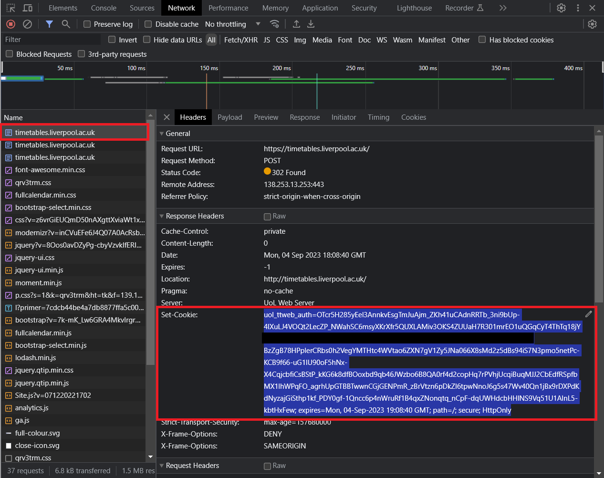

# UoL Timetable website to ICS tool
This tool uses the UoL Timetable API to extract all published events for the next 10 years - although timetables are usually published on a per-semester basis.
An ICS (iCalendar) file is output, which can be imported into most online calendars like Gmail, Outlook etc.

## Setup
This script requires two non-standard libraries:
- ICS
- Requests

`pip install -r requirements.txt`

## Prerequesites
You will have to provide an authenication token to access the UoL Timetable API.
As it uses Azure AD, there is not an easy way to get this programaticlly without being a UoL admin. Therefore, you should manually aquire this token:
1. Open browser developer tools and inspect network traffic
2. Log into [UoL Timetables](timetables.liverpool.ac.uk)
3. Look for the first request to `timetables.liverpool.ac.uk` and copy the `Set-Cookie` response header. See screenshot below:

4. Paste this value into line 11 of [main.py](main.py)
5. Execute the python script: `py main.py`
6. Review the generated ICS file and import into calendar of choice.